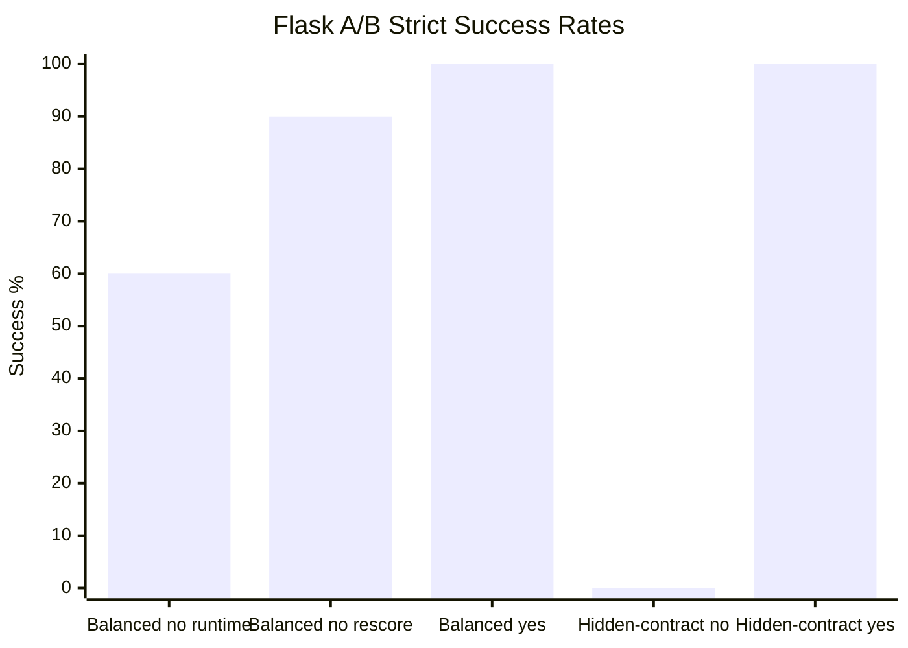

# Harness Agent Benchmark Runner

Benchmark infrastructure for measuring coding-agent behavior against
deterministic repository tasks. The runner isolates each attempt under `runs/`,
records append-only JSONL evidence under `results/`, and publishes only
credential-safe summaries in `docs/benchmarks/`.

This README is the short evidence front page. Operational details live in task
specs, runner code, and detailed benchmark reports.

## Benchmark Status

Current official evidence is the balanced hidden-oracle Flask A/B 20-run pilot.
Both targets received the task-critical API contract in the prompt, while only
the harnessed target retained repository-local workflow, documentation,
boundary, and local-gate guidance.

Detailed report:
[`docs/benchmarks/2026-06-12-hidden-flask-balanced-ab-20-pilot.md`](docs/benchmarks/2026-06-12-hidden-flask-balanced-ab-20-pilot.md).

This is official pilot evidence, not representative large-run evidence. It is
the fairest current Flask harness-effect signal because the previous
hidden-contract calibration gave the harnessed repository much more
task-specific contract information.

## Current Evidence

| Target | Harness | Runs | Run-time strict successes | Current concept-docs rescore | Functional failures after rescore | Original docs phrase failures | Boundary/infra issues |
| --- | --- | ---: | ---: | ---: | ---: | ---: | ---: |
| `flask-no-harness` | No | 10 | 6 | 9 | 1 | 3 | 0 |
| `flask-yes-harness` | Yes | 10 | 10 | 10 | 0 | 0 | 0 |

Boundary/infra issues combine wrong-file edits, forbidden-file edits, and
agent timeouts. All three were 0 on both sides in the balanced pilot.

Guardrail detail:

| Target | Wrong-file edits | Forbidden-file edits | Timeouts |
| --- | ---: | ---: | ---: |
| `flask-no-harness` | 0 | 0 | 0 |
| `flask-yes-harness` | 0 | 0 | 0 |

The no-harness target passed 6/10 once endpoint, method, request shape,
response keys, constants, status codes, and business rules were moved into the
prompt. The yes-harness target stayed at 10/10. Under the original pilot oracle,
three no-harness failures were glossary phrase misses and one was a cart
validation summary mismatch. After the docs oracle was relaxed to route and
domain-term checks, the same saved run directories rescore to 9/10 for
`flask-no-harness` and 10/10 for `flask-yes-harness`; the remaining no-harness
miss is the cart validation summary.

## What This Shows

The balanced pilot no longer measures whether the agent can guess a hidden API
contract from repository conventions. It measures whether repository harnessing
improves completion after the basic contract is shared:

| Dimension | Observed signal |
| --- | --- |
| Functional implementation | Under the current oracle, no-harness has 1 functional hidden-oracle miss; yes-harness has 0. |
| Companion documentation | The original phrase-based docs oracle produced 3 no-harness misses; the current route/domain-term docs oracle accepts those saved outputs. |
| File-boundary discipline | both targets had 0 wrong-file edits and 0 forbidden-file edits. |
| Timeout stability | both targets had 0 timeouts. |
| Local workflow use | yes-harness also ran its local harness gate before the hidden oracle. |

This is a narrower and more defensible claim than the earlier hidden-contract
calibration: the harness appears to improve implementation completeness and
docs discipline under the measured Flask API task shape. It is not a generic
claim about all coding tasks or all repositories.

## Why Use The Harness

The harness is useful when agent success depends on more than writing code that
passes obvious local tests. It gives the repository a durable way to teach and
enforce local expectations without putting every convention into every prompt.

| Harness advantage | Practical effect | Evidence in current pilot |
| --- | --- | --- |
| Repository-local guidance | Agents can find project conventions, docs locations, and completion gates inside the target repository. | yes-harness completed 10/10; no-harness completed 6/10 at run time and 9/10 under the current concept-docs rescore. |
| Better companion docs discipline | Agents are steered toward the documented docs location and expected terminology. | The original phrase-based docs oracle produced 3 no-harness docs misses, but the revised concept-docs oracle accepts those saved outputs; rerun evidence is needed for a stable docs-discipline claim. |
| Local gate before hidden scoring | The harnessed target can run repository-specific checks before the external hidden oracle. | yes-harness ran `scripts/check_harness.py` before hidden oracle checks. |
| Boundary reinforcement | The target can state what files are in scope and what files are off-limits. | Both targets had 0 wrong-file edits here; earlier hidden-oracle runs showed boundary drift when prompt wording was weaker. |
| Less prompt burden over time | Stable conventions live in the repo instead of being repeated in every benchmark prompt. | The balanced prompt exposed the API contract; harness guidance still carried workflow, docs, and gate behavior. |

The current evidence does not prove that a harness always improves raw coding
ability. It shows a more specific and useful thing: under convention-heavy
repository tasks, the harness can reduce missed local expectations and make
successful agent work more repeatable.

## Evidence Trail

| Scope | Agent | Mode | Runs | Run-time strict successes | Current concept-docs rescore | Functional failures after rescore | Original docs phrase failures | Boundary/infra issues |
| --- | --- | --- | ---: | ---: | ---: | ---: | ---: | ---: |
| `flask-yes-harness` balanced hidden-oracle A/B | Codex CLI | 20-run pilot | 10 | 10 | 10 | 0 | 0 | 0 |
| `flask-no-harness` balanced hidden-oracle A/B | Codex CLI | 20-run pilot | 10 | 6 | 9 | 1 | 3 | 0 |
| `flask-yes-harness` hidden-contract calibration | Codex CLI | 1x, 10 tasks | 10 | 10 | 10 | 0 | 0 | 0 |
| `flask-no-harness` hidden-contract calibration | Codex CLI | 1x, 10 tasks | 10 | 0 | 0 | 10 | 0 | 0 |
| `flask-yes-harness` hidden-oracle A/B | Codex CLI | 3x, 4 tasks | 12 | 11 | 11 | 1 | 0 | 0 |
| `flask-no-harness` hidden-oracle A/B | Codex CLI | 3x, 4 tasks | 12 | 0 | 0 | 9 | 0 | 14 |
| `flask-yes-harness` complex visible-oracle A/B | Codex CLI | 3x, 4 tasks | 12 | 11 | 11 | 0 | 0 | 1 |
| `flask-no-harness` complex visible-oracle A/B | Codex CLI | 3x, 4 tasks | 12 | 10 | 12 | 0 | 0 | 2 |

Older `harness-starter-kit` runs remain useful agent-adapter evidence, but the
Flask A/B rows are the relevant harness-effect evidence.



## Metric Definitions

- `Strict scored success`: final scored success after agent exit, diff check,
  verification, and file-boundary checks. A passing test suite alone is not
  counted as full success if file boundaries are violated.
- `Verification passed`: deterministic pytest plus hidden-oracle success before
  any file-boundary penalty.
- `Functional oracle failures`: hidden-oracle failures in endpoint behavior,
  response shape, calculations, status codes, mutation behavior, or edge cases.
- `Docs oracle failures`: hidden-oracle failures in required companion
  documentation content or placement.
- `Wrong-file edits`: changed files outside the task's expected file boundary.
  In these Flask runs, root `README.md` is outside the allowed companion-docs
  path (`docs/**`) unless the task explicitly asks for README changes. A
  README edit here is not a functional failure by itself and is not a general
  claim that README edits are bad; it is a strict boundary miss.
- `Forbidden-file edits`: changed files matching explicitly forbidden patterns.
- `Timeouts`: agent process failed to exit before the effective task timeout.

## What Comes Next

The docs oracle policy has been settled toward concept-based checks: companion
docs should mention the relevant route and domain terms, not one exact English
phrase. After rerunning the balanced pilot with that revised oracle, a 100-run
balanced run with 10 task pairs and `repeats=5` is the right next evidence
step. The current pilot already showed clean execution: 20/20 completed, 0
wrong-file edits, 0 forbidden-file edits, and 0 timeouts.

After this oracle update lands, verify the 100-run plan and then execute it:

```bash
python3 scripts/run_hidden_flask_ab.py \
  --mode large \
  --task-dir benchmarks/tasks/flask-hidden-balanced \
  --repeats 5

stamp=$(date -u +%Y%m%dT%H%M%SZ)
python3 scripts/run_hidden_flask_ab.py \
  --mode large \
  --task-dir benchmarks/tasks/flask-hidden-balanced \
  --repeats 5 \
  --workspace "runs/hidden-flask-ab-balanced-100-${stamp}" \
  --results "results/hidden-flask-ab-balanced-100-${stamp}" \
  --execute
```

## Reports

- [`docs/benchmarks/2026-06-12-hidden-flask-balanced-ab-20-pilot.md`](docs/benchmarks/2026-06-12-hidden-flask-balanced-ab-20-pilot.md)
- [`docs/benchmarks/2026-06-12-hidden-flask-ab-calibration-1x.md`](docs/benchmarks/2026-06-12-hidden-flask-ab-calibration-1x.md)
- [`docs/benchmarks/2026-06-12-hidden-flask-ab-partial-calibration-35.md`](docs/benchmarks/2026-06-12-hidden-flask-ab-partial-calibration-35.md)
- [`docs/benchmarks/2026-06-11-hidden-oracle-harness-effect-ab-3x.md`](docs/benchmarks/2026-06-11-hidden-oracle-harness-effect-ab-3x.md)
- [`docs/benchmarks/2026-06-11-complex-harness-effect-ab-3x.md`](docs/benchmarks/2026-06-11-complex-harness-effect-ab-3x.md)
- [`docs/benchmarks/2026-06-11-harness-effect-ab-3x.md`](docs/benchmarks/2026-06-11-harness-effect-ab-3x.md)
- [`docs/benchmarks/latest.md`](docs/benchmarks/latest.md)

Raw `runs/`, `results/`, local logs, cloned repositories, and credentials are
intentionally not committed. Public reports summarize reproducible,
credential-safe fields from local records.
