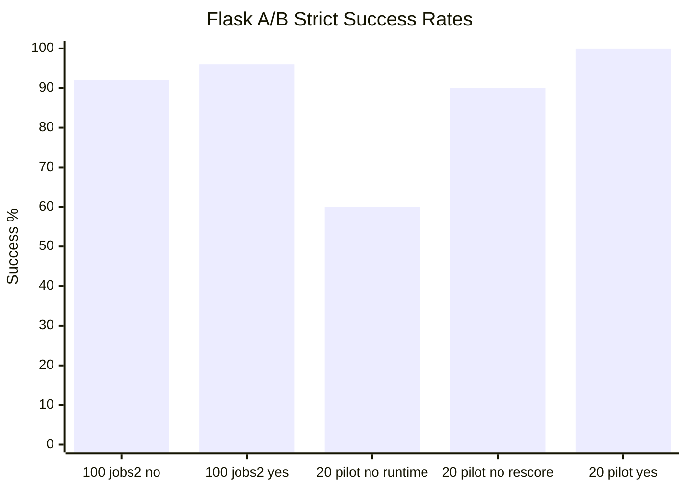

# Harness Agent Benchmark Runner

Benchmark infrastructure for measuring coding-agent behavior against
deterministic repository tasks. The runner isolates each attempt under `runs/`,
records append-only JSONL evidence under `results/`, and publishes only
credential-safe summaries in `docs/benchmarks/`.

This README is the short evidence front page. Operational details live in task
specs, runner code, and detailed benchmark reports.

## Benchmark Status

Current official evidence is still the balanced hidden-oracle Flask A/B 100-run
`jobs=2` evidence run, but it should now be read as a full-contract control.
Both targets received the task-critical API contract in the prompt, while only
the harnessed target retained repository-local workflow, documentation,
boundary, and local-gate guidance.

Detailed report:
[`docs/benchmarks/2026-06-12-hidden-flask-balanced-ab-100-jobs2.md`](docs/benchmarks/2026-06-12-hidden-flask-balanced-ab-100-jobs2.md).

Latest heldout mitigation diagnostic:
[`docs/benchmarks/2026-06-13-hidden-flask-heldout-stable8-noedit-2round-pilot.md`](docs/benchmarks/2026-06-13-hidden-flask-heldout-stable8-noedit-2round-pilot.md).
After adding `--agent-no-edit-timeout`, the fresh 2-round stable-8 readiness
pilot completed all 16 records with 0 stalls, 0 timeouts, 0 wrong-file edits, 0
forbidden-file edits, and 0 hidden-access findings. A dry-run 96-record
promotion plan passed the clean-readiness gate against these results. This
clears the immediate operational no-edit-tail blocker for the reduced suite,
but it is still not product evidence: strict success was 0/16 and
schema-contract success was 0/16.

Latest three-arm product diagnostic:
[`docs/benchmarks/2026-06-13-hidden-flask-three-arm-stable4-docslim-pilot.md`](docs/benchmarks/2026-06-13-hidden-flask-three-arm-stable4-docslim-pilot.md).
After trimming the memory target guidance into a shorter feature fast path, the
fresh three-arm stable-4 pilot completed all 12 planned records with 0 stalls,
0 timeouts, 0 hidden-access findings, 0 wrong-file edits, and 0 forbidden-file
edits. Strict success was `bare` 0/4, `workflow-only` 0/4, and
`memory-harness` 1/4. Schema-contract success was `bare` 0/4,
`workflow-only` 3/4, and `memory-harness` 3/4.

Operational follow-up remains split into two suite manifests:
`benchmarks/suites/flask-hidden-heldout-stable-8.json` for reduced heldout
promotion pilots with `bundle-quote` excluded, and
`benchmarks/suites/flask-hidden-heldout-bundlequote-quarantine.json` for
focused bundle-quote tail-latency triage. The first reduced promotion attempt
found a workflow-only `cart-validation` idle stall, and the stronger 2-round
pilot found a bare `cart-validation` idle stall, so this split is a diagnostic
control. The no-edit readiness pilot now makes a 96-record reduced promotion
operationally possible, but the product-value path should first address the
0/16 strict and 0/16 schema-contract result. A focused full-contract control
now shows the stable oracle/adapter path can pass when the contract is explicit;
the remaining product path is the intended three-arm `memory-harness` suite or
a smaller partial-realistic convention pilot with nonzero schema signal.

Latest full-contract control:
[`docs/benchmarks/2026-06-13-hidden-flask-workflow-smoke-stable4-fullcontract-control.md`](docs/benchmarks/2026-06-13-hidden-flask-workflow-smoke-stable4-fullcontract-control.md).
The first stable-4 control passed 6/8 records. The two failures were both
`cart-validation` and came from ambiguous summary key wording. After tightening
the prompt and summary functional oracle, a focused `cart-validation` rerun
passed 2/2 strict with 0 stalls, 0 timeouts, and 0 boundary issues.

The balanced 100-run is representative for the explicitly measured `jobs=2` run
shape. It is not a pure sequential claim: the run produced timeout noise, so
strict scored success and verification passed should be read separately.

The next product-value experiment should still use a fixed three-arm structure:
`bare`, `workflow-only`, and `memory-harness`, but the first pilot shows that a
larger run is premature. The main product experiment is `partial-realistic`
held-out work where task-specific answer strings are absent from the target
repositories. A targeted rerun of the previous memory-harness
`catalog-segments` no-edit failure passed after trimming the memory guidance
into a shorter feature fast path, but this is still only a one-record
mitigation check. The full 12-record pilot then completed cleanly, so the next
step is a second clean 12-record round because the promotion guard requires at
least two clean rounds. If that second round is also clean, the promotion
candidate is a balanced 96-record run (`repeats=8`) rather than exactly 100
records. It should stay on `jobs=1` with `--stop-on-abnormal` and the
360-second no-edit watchdog.
`full-contract` prompts remain useful controls; small gaps there are expected
because the prompt already supplies much of the answer.

## Current Evidence

| Target | Harness | Runs | Strict successes | Verification passed | Non-timeout oracle failures | Timeouts | Boundary issues |
| --- | --- | ---: | ---: | ---: | ---: | ---: | ---: |
| `flask-no-harness` | No | 50 | 46 | 46 | 3 | 1 | 0 |
| `flask-yes-harness` | Yes | 50 | 48 | 49 | 0 | 2 | 0 |

Boundary issues combine wrong-file edits and forbidden-file edits. Both were 0
on both sides in the 100-run jobs=2 evidence run.

Guardrail detail:

| Target | Wrong-file edits | Forbidden-file edits | Timeouts |
| --- | ---: | ---: | ---: |
| `flask-no-harness` | 0 | 0 | 1 |
| `flask-yes-harness` | 0 | 0 | 2 |

The no-harness target reached 46/50 strict successes after endpoint, method,
request shape, response keys, constants, status codes, and business rules were
moved into the prompt. The yes-harness target reached 48/50. Verification
passed was 46/50 vs 49/50, showing a small residual harness lift under equal
prompt-level contract disclosure. Timeout behavior moved against the harnessed
target under `jobs=2`, so timeout stability remains unresolved.

## What This Shows

The balanced pilot no longer measures whether the agent can guess a hidden API
contract from repository conventions. It measures whether repository harnessing
improves completion after the basic contract is shared:

| Dimension | Observed signal |
| --- | --- |
| Functional implementation | no-harness had 2 reservation-preview summary misses; yes-harness had no non-timeout functional oracle misses. |
| Companion documentation | no-harness had 1 catalog-metrics docs concept miss; yes-harness had none. |
| File-boundary discipline | both targets had 0 wrong-file edits and 0 forbidden-file edits. |
| Timeout stability | jobs=2 produced 1 no-harness timeout and 2 yes-harness timeouts, so this run does not show a harness timeout advantage. |
| Local workflow use | yes-harness also ran its local harness gate before the hidden oracle. |

This is a narrower and more defensible claim than the earlier hidden-contract
calibration: the harness appears to produce a small residual verification-rate
lift under the measured Flask API task shape. It is not a generic claim about
all coding tasks or all repositories.

It is also not a clean `memory-harness` product claim. A valid product claim
needs the three arms separated so `workflow-only` cannot be confused with
generalized memory, and so task-specific hidden answers cannot leak into target
docs or failure memory.

## Why Use The Harness

The harness is useful when agent success depends on more than writing code that
passes obvious local tests. It gives the repository a durable way to teach and
enforce local expectations without putting every convention into every prompt.

| Harness advantage | Practical effect | Evidence in latest run |
| --- | --- | --- |
| Repository-local guidance | Agents can find project conventions, docs locations, and completion gates inside the target repository. | yes-harness completed 48/50 strict successes and 49/50 verification passes; no-harness completed 46/50 on both measures. |
| Better companion docs discipline | Agents are steered toward the documented docs location and expected terminology. | no-harness had 1 catalog-metrics docs concept miss in the 100-run jobs=2 evidence run; yes-harness had none. |
| Local gate before hidden scoring | The harnessed target can run repository-specific checks before the external hidden oracle. | yes-harness ran `scripts/check_harness.py` before hidden oracle checks. |
| Boundary reinforcement | The target can state what files are in scope and what files are off-limits. | Both targets had 0 wrong-file edits in the latest 100-run jobs=2 evidence run; earlier hidden-oracle runs showed boundary drift when prompt wording was weaker. |
| Less prompt burden over time | Stable conventions live in the repo instead of being repeated in every benchmark prompt. | The balanced prompt exposed the API contract; harness guidance still carried workflow, docs, and gate behavior. |

The current evidence does not prove that a harness always improves raw coding
ability. It shows a more specific and useful thing: under convention-heavy
repository tasks, the harness can reduce missed local expectations and make
successful agent work more repeatable.

## Evidence Trail

| Scope | Agent | Mode | Runs | Strict successes | Verification passed | Timeouts | Boundary issues |
| --- | --- | --- | ---: | ---: | ---: | ---: | ---: |
| `flask-yes-harness` balanced hidden-oracle A/B | Codex CLI | 100-run jobs=2 | 50 | 48 | 49 | 2 | 0 |
| `flask-no-harness` balanced hidden-oracle A/B | Codex CLI | 100-run jobs=2 | 50 | 46 | 46 | 1 | 0 |
| `flask-yes-harness` balanced hidden-oracle A/B | Codex CLI | 20-run pilot, run-time oracle | 10 | 10 | 10 | 0 | 0 |
| `flask-no-harness` balanced hidden-oracle A/B | Codex CLI | 20-run pilot, run-time oracle | 10 | 6 | 6 | 0 | 0 |

Older `harness-starter-kit` runs remain useful agent-adapter evidence, but the
Flask A/B rows are the relevant harness-effect evidence.

## Metric Definitions

- `Functional success`: hidden-oracle behavior for commands tagged
  `functional`.
- `Schema contract success`: response envelope, key, metadata, and API-style
  checks for commands tagged `schema`.
- `Workflow success`: agent exit, diff check, local workflow/gate commands
  tagged `workflow`, and file-boundary checks.
- `Strict scored success`: final scored success after preflight, agent exit,
  diff check, verification, and file-boundary checks. A passing test suite alone is not
  counted as full success if file boundaries are violated.
- `Verification passed`: deterministic pytest plus hidden-oracle success before
  any file-boundary penalty.
- `Functional oracle failures`: hidden-oracle failures in endpoint behavior,
  response shape, calculations, status codes, mutation behavior, or edge cases.
- `Docs oracle failures`: hidden-oracle failures in required companion
  documentation content or placement.
- `Wrong-file edits`: changed files outside the task's expected file boundary.
  In these Flask runs, root `README.md` is outside the allowed companion-docs
  path (`docs/**`) unless the task explicitly asks for README changes. A
  README edit here is not a functional failure by itself and is not a general
  claim that README edits are bad; it is a strict boundary miss.
- `Forbidden-file edits`: changed files matching explicitly forbidden patterns.
- `Timeouts`: agent process failed to exit before the effective task timeout.
- `Stalls`: agent process was stopped by the shorter pilot watchdog
  (`--agent-stall-timeout`), the idle-output watchdog
  (`--agent-idle-timeout`), or the no-edit watchdog
  (`--agent-no-edit-timeout`). Count this separately from product-quality
  oracle failures.
- `Preflight failures`: leakage audit failures before agent execution. These
  should fail the run without spending model budget.

## What Comes Next

The next useful follow-up is not another identical `jobs=2` run, another
full-heldout 100-record attempt that includes `bundle-quote`, or another
unchanged reduced 96-record product-value promotion. Keep `bundle-quote` in
`benchmarks/suites/flask-hidden-heldout-bundlequote-quarantine.json`, but do
not quarantine `cart-validation` as a harness-only problem. The no-edit
readiness pilot clears the immediate tail-stability blocker, and the promotion
guard now requires `--agent-no-edit-timeout` alongside
`--agent-idle-timeout`, `--agent-timeout-override`, and clean prior results.

The current blocker is product signal quality: the latest partial-realistic
stable-8 pilot had 0/16 strict successes and 0/16 schema-contract successes,
while the full-contract control path now passes after tightening the
cart-validation summary contract. The intended three-arm held-out suite is now
scaffolded as `benchmarks/suites/flask-hidden-three-arm-stable4.json`, with a
local `../flask-memory-harness` target pinned to
`bc097c48d592e7ddcd26beb7bb2c185d7a33fa59`. Before spending on another near-100
product run, use that 12-record three-arm pilot or another small
partial-realistic convention pilot to establish nonzero schema-contract signal.
Keep functional, schema-contract, workflow, boundary, strict success, and
timeout counts separate in the report.
For held-out pilots, use either a short
`--agent-stall-timeout` when deliberately testing pilot-stop behavior or
`--agent-idle-timeout` when long active runs should continue. For promotion,
prefer `--agent-idle-timeout` and `--agent-no-edit-timeout` plus the task
timeout so long-but-active runs with real edits can continue while active
no-edit tails are stopped. If a promotion run needs more than 600 seconds, pass
an explicit `--agent-timeout-override` and keep
`--max-agent-timeout` at or above that value; `--max-agent-timeout` only caps
task timeouts and does not extend a task whose `timeout_seconds` is already
lower.
Keep adapter hygiene enabled during promotion checks:
`CODEX_IGNORE_USER_CONFIG=1`, `CODEX_IGNORE_RULES=1`, and
`CODEX_DISABLE_PLUGINS=1`.

To separate task quality from scheduler pressure, either rerun representative
shapes sequentially or rerun `jobs=2` with an explicitly higher timeout cap.
Timeout stability remains unresolved until a sequential follow-up rules out
parallel scheduler pressure.

## Reports

- [`docs/benchmarks/2026-06-13-hidden-flask-heldout-stable8-2round-pilot-aborted.md`](docs/benchmarks/2026-06-13-hidden-flask-heldout-stable8-2round-pilot-aborted.md)
- [`docs/benchmarks/2026-06-13-hidden-flask-heldout-stable8-finalmitigation-aborted-96.md`](docs/benchmarks/2026-06-13-hidden-flask-heldout-stable8-finalmitigation-aborted-96.md)
- [`docs/benchmarks/2026-06-13-hidden-flask-heldout-finalmitigation-aborted-100.md`](docs/benchmarks/2026-06-13-hidden-flask-heldout-finalmitigation-aborted-100.md)
- [`docs/benchmarks/2026-06-13-hidden-flask-heldout-idlewatch-aborted-100.md`](docs/benchmarks/2026-06-13-hidden-flask-heldout-idlewatch-aborted-100.md)
- [`docs/benchmarks/2026-06-12-hidden-flask-heldout-promptguard-aborted-100.md`](docs/benchmarks/2026-06-12-hidden-flask-heldout-promptguard-aborted-100.md)
- [`docs/benchmarks/2026-06-12-hidden-flask-heldout-memoryhide-aborted-pilot.md`](docs/benchmarks/2026-06-12-hidden-flask-heldout-memoryhide-aborted-pilot.md)
- [`docs/benchmarks/2026-06-12-hidden-flask-balanced-ab-100-jobs2.md`](docs/benchmarks/2026-06-12-hidden-flask-balanced-ab-100-jobs2.md)
- [`docs/benchmarks/2026-06-12-hidden-flask-balanced-ab-20-jobs2-calibration.md`](docs/benchmarks/2026-06-12-hidden-flask-balanced-ab-20-jobs2-calibration.md)
- [`docs/benchmarks/2026-06-12-hidden-flask-balanced-ab-20-pilot.md`](docs/benchmarks/2026-06-12-hidden-flask-balanced-ab-20-pilot.md)
- [`docs/benchmarks/2026-06-12-hidden-flask-ab-calibration-1x.md`](docs/benchmarks/2026-06-12-hidden-flask-ab-calibration-1x.md)
- [`docs/benchmarks/2026-06-12-hidden-flask-ab-partial-calibration-35.md`](docs/benchmarks/2026-06-12-hidden-flask-ab-partial-calibration-35.md)
- [`docs/benchmarks/2026-06-11-hidden-oracle-harness-effect-ab-3x.md`](docs/benchmarks/2026-06-11-hidden-oracle-harness-effect-ab-3x.md)
- [`docs/benchmarks/2026-06-11-complex-harness-effect-ab-3x.md`](docs/benchmarks/2026-06-11-complex-harness-effect-ab-3x.md)
- [`docs/benchmarks/2026-06-11-harness-effect-ab-3x.md`](docs/benchmarks/2026-06-11-harness-effect-ab-3x.md)
- [`docs/benchmarks/latest.md`](docs/benchmarks/latest.md)

Raw `runs/`, `results/`, local logs, cloned repositories, and credentials are
intentionally not committed. Public reports summarize reproducible,
credential-safe fields from local records.
