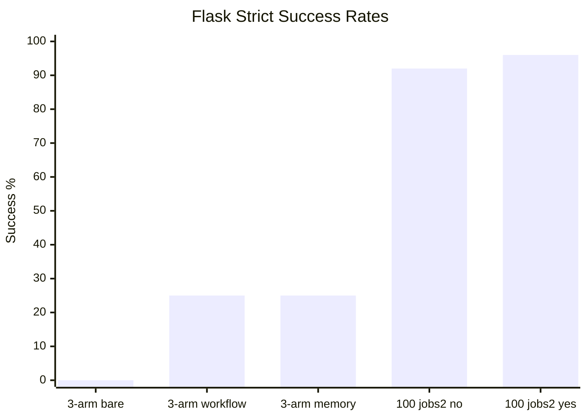

# Harness Agent Benchmark Runner

Benchmark infrastructure for measuring coding-agent behavior against
deterministic repository tasks. The runner isolates each attempt under `runs/`,
records append-only JSONL evidence under `results/`, and publishes only
credential-safe summaries in `docs/benchmarks/`.

This README is the short evidence front page. Operational details live in task
specs, runner code, and detailed benchmark reports.

## Benchmark Status

Current official product diagnostic is the sequential three-arm stable-4
all-slim promotion96 run. It compares `bare`, `workflow-only`, and
`memory-harness` under partial-realistic held-out prompts with task-specific
answers kept out of target repositories.

Detailed report:
[`docs/benchmarks/2026-06-13-hidden-flask-three-arm-stable4-allslim-promotion96.md`](docs/benchmarks/2026-06-13-hidden-flask-three-arm-stable4-allslim-promotion96.md).

The run completed all 96 planned records with 0 stalls, 0 timeouts,
0 hidden-access findings, 0 wrong-file edits, and 0 forbidden-file edits.
`bare` scored 0/32 strict and 0/32 schema. `workflow-only` and
`memory-harness` both scored 8/32 strict, 8/32 functional, and 24/32 schema.
The strict lift came entirely from `catalog-segments`; the schema lift came
from `availability-badge`, `catalog-metrics`, and `catalog-segments`.
`cart-validation` remains 0/8 strict across all arms.

The memory arm did not beat workflow-only on correctness in this suite. Its
current signal is operational repeatability: p95 duration was 86.2s and max was
87.6s, versus workflow-only p95 124.1s and max 544.7s.

The older balanced hidden-oracle Flask A/B 100-run `jobs=2` report remains a
useful full-contract control, not the main product claim. In that run both
targets received the task-critical API contract in the prompt, while only the
harnessed target retained repository-local workflow, documentation, boundary,
and local-gate guidance. Its timeout stability remains unresolved because that
parallel run produced timeout noise.

Latest v2 smoke:
[`docs/benchmarks/2026-06-13-hidden-flask-three-arm-v2-smoke.md`](docs/benchmarks/2026-06-13-hidden-flask-three-arm-v2-smoke.md).
The first v2 held-out task, `hidden-effect-replenishment-signals`, completed
3/3 records cleanly. `bare` failed functional/schema scoring, while
`workflow-only` and `memory-harness` both passed strict scoring. This validates
the v2 scaffold and gives an early convention-transfer signal; it is not a
replacement for the 96-record stable-4 promotion.

## Current Evidence

| Target | Arm | Runs | Strict successes | Functional successes | Schema successes | Timeouts | Boundary issues |
| --- | --- | ---: | ---: | ---: | ---: | ---: | ---: |
| `flask-no-harness` | `bare` | 32 | 0 | 0 | 0 | 0 | 0 |
| `flask-yes-harness` | `workflow-only` | 32 | 8 | 8 | 24 | 0 | 0 |
| `flask-memory-harness` | `memory-harness` | 32 | 8 | 8 | 24 | 0 | 0 |
| `flask-no-harness` | `bare` v2 smoke | 1 | 0 | 0 | 0 | 0 | 0 |
| `flask-yes-harness` | `workflow-only` v2 smoke | 1 | 1 | 1 | 1 | 0 | 0 |
| `flask-memory-harness` | `memory-harness` v2 smoke | 1 | 1 | 1 | 1 | 0 | 0 |

Boundary issues combine wrong-file edits and forbidden-file edits. Both were 0
across all three arms in the promotion96 run.

Guardrail detail:

| Target | Wrong-file edits | Forbidden-file edits | Timeouts |
| --- | ---: | ---: | ---: |
| `flask-no-harness` | 0 | 0 | 0 |
| `flask-yes-harness` | 0 | 0 | 0 |
| `flask-memory-harness` | 0 | 0 | 0 |

The three-arm result shows a contract-shape and convention-transfer lift, not a
general raw-coding lift. `workflow-only` and `memory-harness` tied on strict,
functional, and schema success. The memory arm's current advantage is lower
duration tail, not higher correctness.

## What This Shows

The latest promotion measures partial-realistic held-out work, not a
full-contract prompt where the task answer is already disclosed:

| Dimension | Observed signal |
| --- | --- |
| Functional implementation | harness arms passed `catalog-segments` 8/8 strict; `bare` passed 0/8. |
| Schema contract | harness arms reached 24/32 schema success; `bare` reached 0/32. |
| Memory-specific accuracy | `memory-harness` tied `workflow-only` on strict, functional, and schema success. |
| Duration tail | `memory-harness` max duration was 87.6s versus workflow-only 544.7s and bare 639.3s. |
| Boundary discipline | all three arms had 0 wrong-file edits and 0 forbidden-file edits. |

This is a narrower and more defensible claim than the earlier hidden-contract
calibrations: harness guidance improved response-envelope/schema behavior and
one convention-transfer task. It did not solve every semantic task, and the
current memory layer is not yet an accuracy win over workflow-only.

## Why Use The Harness

The harness is useful when agent success depends on more than writing code that
passes obvious local tests. It gives the repository a durable way to teach and
enforce local expectations without putting every convention into every prompt.

| Harness advantage | Practical effect | Evidence in latest run |
| --- | --- | --- |
| Repository-local guidance | Agents can find project conventions, docs locations, and completion gates inside the target repository. | harness arms reached 24/32 schema success; bare reached 0/32. |
| Better companion docs discipline | Agents are steered toward the documented docs location and expected terminology. | harness arms passed `catalog-segments` 8/8 strict; bare missed the docs/schema contract. |
| Local gate before hidden scoring | The harnessed target can run repository-specific checks before the external hidden oracle. | `workflow-only` and `memory-harness` ran their local gates before hidden oracle checks. |
| Boundary reinforcement | The target can state what files are in scope and what files are off-limits. | all three promotion arms had 0 wrong-file edits and 0 forbidden-file edits. |
| Less prompt burden over time | Stable conventions live in the repo instead of being repeated in every benchmark prompt. | partial-realistic prompts omitted task-specific answer strings, while harness guidance carried general API/documentation conventions. |

The current evidence does not prove that a harness always improves raw coding
ability. It shows a more specific and useful thing: under convention-heavy
repository tasks, the harness can reduce missed local expectations and make
some successful agent work more repeatable.

## Evidence Trail

| Scope | Agent | Mode | Runs | Strict successes | Verification passed | Timeouts | Boundary issues |
| --- | --- | --- | ---: | ---: | ---: | ---: | ---: |
| `flask-memory-harness` three-arm stable-4 | Codex CLI | all-slim promotion96 | 32 | 8 | 8 | 0 | 0 |
| `flask-yes-harness` three-arm stable-4 | Codex CLI | all-slim promotion96 | 32 | 8 | 8 | 0 | 0 |
| `flask-no-harness` three-arm stable-4 | Codex CLI | all-slim promotion96 | 32 | 0 | 0 | 0 | 0 |
| `flask-memory-harness` three-arm v2 | Codex CLI | replenishment smoke | 1 | 1 | 1 | 0 | 0 |
| `flask-yes-harness` three-arm v2 | Codex CLI | replenishment smoke | 1 | 1 | 1 | 0 | 0 |
| `flask-no-harness` three-arm v2 | Codex CLI | replenishment smoke | 1 | 0 | 0 | 0 | 0 |
| `flask-yes-harness` balanced hidden-oracle A/B | Codex CLI | 100-run jobs=2 | 50 | 48 | 49 | 2 | 0 |
| `flask-no-harness` balanced hidden-oracle A/B | Codex CLI | 100-run jobs=2 | 50 | 46 | 46 | 1 | 0 |
| `flask-yes-harness` balanced hidden-oracle A/B | Codex CLI | 20-run pilot, run-time oracle | 10 | 10 | 10 | 0 | 0 |
| `flask-no-harness` balanced hidden-oracle A/B | Codex CLI | 20-run pilot, run-time oracle | 10 | 6 | 6 | 0 | 0 |

Older `harness-starter-kit` runs remain useful agent-adapter evidence, but the
Flask rows are the relevant harness-effect evidence.

## Metric Definitions

- `Functional success`: hidden-oracle behavior for commands tagged
  `functional`.
- `Schema contract success`: response envelope, key, metadata, and API-style
  checks for commands tagged `schema`.
- `Workflow success`: agent exit, diff check, local workflow/gate commands
  tagged `workflow`, and file-boundary checks.
- `Strict scored success`: final scored success after preflight, agent exit,
  diff check, verification, and file-boundary checks. A passing test suite alone is not
  counted as full success if file boundaries are violated.
- `Verification passed`: deterministic pytest plus hidden-oracle success before
  any file-boundary penalty.
- `Functional oracle failures`: hidden-oracle failures in endpoint behavior,
  response shape, calculations, status codes, mutation behavior, or edge cases.
- `Docs oracle failures`: hidden-oracle failures in required companion
  documentation content or placement.
- `Wrong-file edits`: changed files outside the task's expected file boundary.
  In these Flask runs, root `README.md` is outside the allowed companion-docs
  path (`docs/**`) unless the task explicitly asks for README changes. A
  README edit here is not a functional failure by itself and is not a general
  claim that README edits are bad; it is a strict boundary miss.
- `Forbidden-file edits`: changed files matching explicitly forbidden patterns.
- `Timeouts`: agent process failed to exit before the effective task timeout.
- `Stalls`: agent process was stopped by the shorter pilot watchdog
  (`--agent-stall-timeout`), the idle-output watchdog
  (`--agent-idle-timeout`), or the no-edit watchdog
  (`--agent-no-edit-timeout`). Count this separately from product-quality
  oracle failures.
- `Preflight failures`: leakage audit failures before agent execution. These
  should fail the run without spending model budget.

## What Comes Next

The next useful follow-up is not another identical stable-4 promotion. The
96-record run is already clean and repeatable enough for this suite. The next
product-value path is the v2 held-out suite scaffolded at
`benchmarks/suites/flask-hidden-three-arm-v2.json`, starting with
`hidden-effect-replenishment-signals`.

Keep the same three arms: `bare`, `workflow-only`, and `memory-harness`. Keep
`partial-realistic` prompts as the main product experiment and `full-contract`
prompts as controls. Keep task-specific answer strings out of target docs and
failure memory.

`cart-validation` should be split or redesigned before it is used as a memory
discriminator. It currently behaves as a hard semantic/API-design task: all
arms scored 0/8 strict and 0/8 schema in the latest promotion.

Grow v2 by adding more new catalog/API tasks that apply the same general
conventions to routes not present in target docs. Each new task should include
functional and schema oracle dimensions, a route leakage audit, and identical
partial-realistic prompts across the three arms.

For held-out pilots, keep functional, schema-contract, workflow, boundary,
strict success, timeout, and duration-tail counts separate in the report. For
promotion, keep `--agent-idle-timeout`, `--agent-no-edit-timeout`,
`--agent-timeout-override`, `--stop-on-abnormal`, and clean prior readiness
results. Long-but-active runs with real edits should continue; active no-edit
tails should stop.

## Reports

- [`docs/benchmarks/2026-06-13-hidden-flask-three-arm-v2-smoke.md`](docs/benchmarks/2026-06-13-hidden-flask-three-arm-v2-smoke.md)
- [`docs/benchmarks/2026-06-13-hidden-flask-three-arm-stable4-allslim-promotion96.md`](docs/benchmarks/2026-06-13-hidden-flask-three-arm-stable4-allslim-promotion96.md)
- [`docs/benchmarks/2026-06-13-hidden-flask-heldout-stable8-2round-pilot-aborted.md`](docs/benchmarks/2026-06-13-hidden-flask-heldout-stable8-2round-pilot-aborted.md)
- [`docs/benchmarks/2026-06-13-hidden-flask-heldout-stable8-finalmitigation-aborted-96.md`](docs/benchmarks/2026-06-13-hidden-flask-heldout-stable8-finalmitigation-aborted-96.md)
- [`docs/benchmarks/2026-06-13-hidden-flask-heldout-finalmitigation-aborted-100.md`](docs/benchmarks/2026-06-13-hidden-flask-heldout-finalmitigation-aborted-100.md)
- [`docs/benchmarks/2026-06-13-hidden-flask-heldout-idlewatch-aborted-100.md`](docs/benchmarks/2026-06-13-hidden-flask-heldout-idlewatch-aborted-100.md)
- [`docs/benchmarks/2026-06-12-hidden-flask-heldout-promptguard-aborted-100.md`](docs/benchmarks/2026-06-12-hidden-flask-heldout-promptguard-aborted-100.md)
- [`docs/benchmarks/2026-06-12-hidden-flask-heldout-memoryhide-aborted-pilot.md`](docs/benchmarks/2026-06-12-hidden-flask-heldout-memoryhide-aborted-pilot.md)
- [`docs/benchmarks/2026-06-12-hidden-flask-balanced-ab-100-jobs2.md`](docs/benchmarks/2026-06-12-hidden-flask-balanced-ab-100-jobs2.md)
- [`docs/benchmarks/2026-06-12-hidden-flask-balanced-ab-20-jobs2-calibration.md`](docs/benchmarks/2026-06-12-hidden-flask-balanced-ab-20-jobs2-calibration.md)
- [`docs/benchmarks/2026-06-12-hidden-flask-balanced-ab-20-pilot.md`](docs/benchmarks/2026-06-12-hidden-flask-balanced-ab-20-pilot.md)
- [`docs/benchmarks/2026-06-12-hidden-flask-ab-calibration-1x.md`](docs/benchmarks/2026-06-12-hidden-flask-ab-calibration-1x.md)
- [`docs/benchmarks/2026-06-12-hidden-flask-ab-partial-calibration-35.md`](docs/benchmarks/2026-06-12-hidden-flask-ab-partial-calibration-35.md)
- [`docs/benchmarks/2026-06-11-hidden-oracle-harness-effect-ab-3x.md`](docs/benchmarks/2026-06-11-hidden-oracle-harness-effect-ab-3x.md)
- [`docs/benchmarks/2026-06-11-complex-harness-effect-ab-3x.md`](docs/benchmarks/2026-06-11-complex-harness-effect-ab-3x.md)
- [`docs/benchmarks/2026-06-11-harness-effect-ab-3x.md`](docs/benchmarks/2026-06-11-harness-effect-ab-3x.md)
- [`docs/benchmarks/latest.md`](docs/benchmarks/latest.md)

Raw `runs/`, `results/`, local logs, cloned repositories, and credentials are
intentionally not committed. Public reports summarize reproducible,
credential-safe fields from local records.
