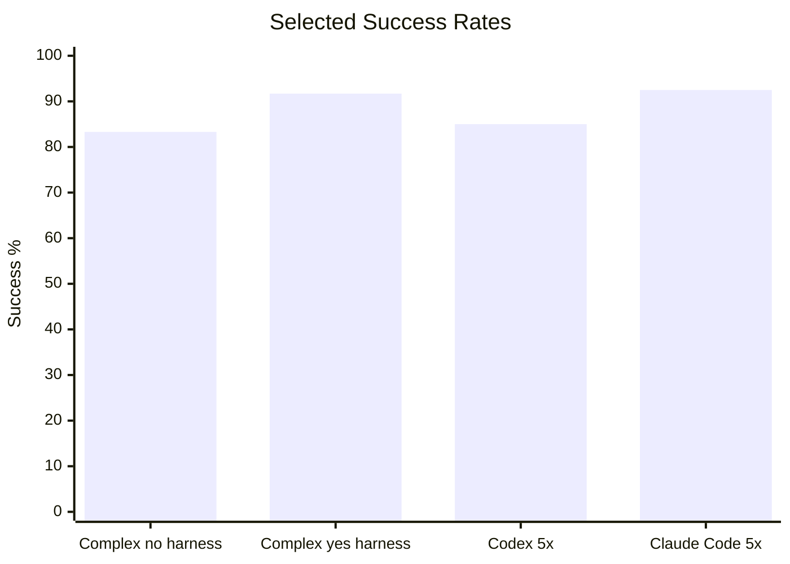

# Harness Agent Benchmark Runner

Benchmark evidence for measuring coding-agent performance on deterministic
repository tasks. This README is intentionally performance-focused; operational
usage details live in code, task specs, and benchmark reports.

## Latest Performance

The latest Flask harness-effect A/B run uses more complex tasks where the prompt
names a repository-specific API but does not restate the full response contract
or companion-document requirements. The harnessed repository contains that
guidance in its local agent instructions and conventions.

| Target | Harness | Agent | Runs | Successes | Success rate | Verification passed | Wrong-file edits | Forbidden-file edits | Timeouts |
| --- | --- | --- | ---: | ---: | ---: | ---: | ---: | ---: | ---: |
| `flask-no-harness` | No | Codex CLI | 12 | 10 | 83.3% | 12 | 2 | 0 | 0 |
| `flask-yes-harness` | Yes | Codex CLI | 12 | 11 | 91.7% | 11 | 0 | 0 | 1 |

Interpretation: in this scoped test, the harness still improved scored success
and file-boundary discipline, but the functional lift was weaker than the first
harness-effect run. The likely reason is oracle leakage: the deterministic
oracle files live inside both target repositories, so Codex can read the exact
contract even in the no-harness clone.

Detailed report:
[`docs/benchmarks/2026-06-11-complex-harness-effect-ab-3x.md`](docs/benchmarks/2026-06-11-complex-harness-effect-ab-3x.md).

## What Yes-Harness Improved

The harnessed Flask target did not make the underlying app easier. It made the
repository's expectations easier for the agent to discover and follow.

| Dimension | `flask-no-harness` | `flask-yes-harness` | Observed effect |
| --- | --- | --- | --- |
| Scored success | 10/12 | 11/12 | Harnessed tasks completed slightly more reliably. |
| Verification | 12/12 | 11/12 | Functional verification was not the main separator in the complex run. |
| File boundaries | 2 wrong-file edits | 0 wrong-file edits | Harness guidance kept edits inside expected paths. |
| Timeouts | 0 timeouts | 1 timeout | The harnessed target still had one long-tail Codex timeout. |
| Companion docs | Two runs also touched `README.md` | No wrong-file edits | Harness guidance better constrained durable-knowledge placement. |

The most important difference is not raw Flask coding ability. Both targets are
solvable. The benefit appears most clearly in repository-local discipline:
documentation placement and allowed edit boundaries. The next stronger
experiment should keep deterministic oracles outside the agent-visible target
clone so the no-harness agent cannot recover the full contract from oracle code.

## Benchmark Evidence

| Scope | Agent | Mode | Runs | Successes | Success rate | Wrong-file edits | Forbidden-file edits | Timeouts |
| --- | --- | --- | ---: | ---: | ---: | ---: | ---: | ---: |
| `flask-yes-harness` complex harness-effect A/B | Codex CLI | Live adapter (3x) | 12 | 11 | 91.7% | 0 | 0 | 1 |
| `flask-no-harness` complex harness-effect A/B | Codex CLI | Live adapter (3x) | 12 | 10 | 83.3% | 2 | 0 | 0 |
| `flask-yes-harness` harness-effect A/B | Codex CLI | Live adapter (3x) | 6 | 6 | 100% | 0 | 0 | 0 |
| `flask-no-harness` harness-effect A/B | Codex CLI | Live adapter (3x) | 6 | 4 | 66.7% | 1 | 0 | 1 |
| `flask-yes-harness` 4-task pilot | Codex CLI | Live adapter (1x) | 4 | 3 | 75% | 0 | 0 | 1 |
| `flask-no-harness` 4-task pilot | Codex CLI | Live adapter (1x) | 4 | 3 | 75% | 0 | 0 | 1 |
| `harness-starter-kit` 8-task dry run | Claude Code CLI | Live adapter (5x) | 40 | 37 | 92.5% | 0 | 0 | 0 |
| `harness-starter-kit` 8-task dry run | Codex CLI | Live adapter (5x) | 40 | 34 | 85% | 0 | 0 | 4 |
| `harness-starter-kit` 8-task dry run | Codex CLI | Live adapter (1x) | 8 | 8 | 100% | 0 | 0 | 0 |
| `harness-starter-kit` 8-task dry run | Claude Opus | Patch replay | 8 | 8 | 100% | 0 | 0 | 0 |

No-op validation runs are excluded from the performance table because they are
negative controls, not agent scores. They are documented in the detailed
benchmark reports.

## What The Metrics Mean

- `Successes`: scored success after agent exit, diff check, verification, and
  file-boundary checks.
- `Verification passed`: deterministic oracle success before file-boundary
  penalties.
- `Wrong-file edits`: changed files outside the task's expected file boundary.
- `Forbidden-file edits`: changed files matching explicitly forbidden patterns.
- `Timeouts`: agent process failed to exit before the effective task timeout.

A passing test suite alone is not counted as full success when file boundaries
are violated.

## Current Findings

- Harness-effect Flask A/B remains harness-positive, but the larger complex
  run narrows the claim: `flask-yes-harness` reached 11/12 while
  `flask-no-harness` reached 10/12, with the clearer improvement in wrong-file
  edits (0 vs 2).
- Target-local oracle visibility is now the main methodology risk. The next A/B
  should use external hidden oracles so the no-harness agent cannot read the
  exact expected contract from `benchmarks/oracles/`.
- The first plain Flask pilot was too easy to show harness lift: both bare and
  harnessed targets produced 4/4 verification passes and 3/4 scored successes.
- The larger `harness-starter-kit` repeated runs show strong boundary
  discipline across agents: 0 wrong-file edits and 0 forbidden-file edits in
  the current Codex and Claude Code 5x snapshots.
- Codex failures in repeated runs are mostly timeout or exact-oracle misses,
  not broad file-boundary failures.

## Detailed Reports

- [`docs/benchmarks/latest.md`](docs/benchmarks/latest.md)
- [`docs/benchmarks/2026-06-11-complex-harness-effect-ab-3x.md`](docs/benchmarks/2026-06-11-complex-harness-effect-ab-3x.md)
- [`docs/benchmarks/2026-06-11-harness-effect-ab-3x.md`](docs/benchmarks/2026-06-11-harness-effect-ab-3x.md)
- [`docs/benchmarks/2026-06-11-flask-yes-harness-codex-pilot.md`](docs/benchmarks/2026-06-11-flask-yes-harness-codex-pilot.md)
- [`docs/benchmarks/2026-06-11-flask-no-harness-codex-pilot.md`](docs/benchmarks/2026-06-11-flask-no-harness-codex-pilot.md)
- [`docs/benchmarks/2026-06-11-codex-cli-5runs.md`](docs/benchmarks/2026-06-11-codex-cli-5runs.md)
- [`docs/benchmarks/2026-06-11-claude-code-5runs.md`](docs/benchmarks/2026-06-11-claude-code-5runs.md)
- [`docs/benchmarks/2026-06-11-benchmark-records-analysis.md`](docs/benchmarks/2026-06-11-benchmark-records-analysis.md)

Raw `runs/` and `results/` artifacts are intentionally not committed. Public
reports summarize reproducible, credential-safe fields from local records.
