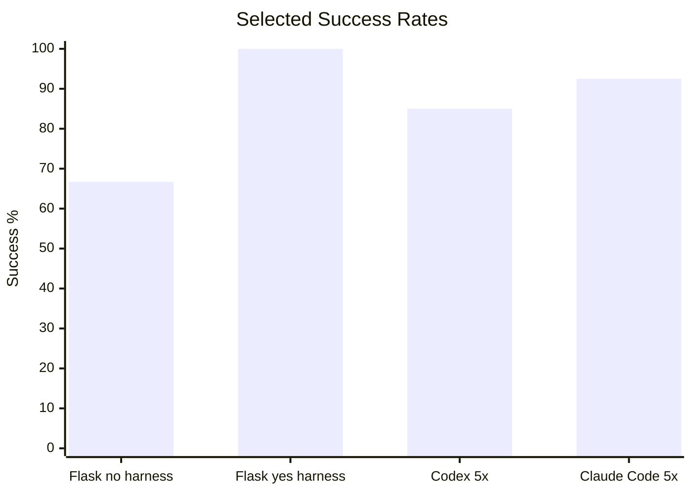

# Harness Agent Benchmark Runner

Benchmark evidence for measuring coding-agent performance on deterministic
repository tasks. This README is intentionally performance-focused; operational
usage details live in code, task specs, and benchmark reports.

## Latest Performance

The clearest current signal is the Flask harness-effect A/B run. It uses tasks
where the prompt names a repository-specific API but does not restate the full
response contract or companion-document requirements. The harnessed repository
contains that guidance in its local agent instructions and conventions.

| Target | Harness | Agent | Runs | Successes | Success rate | Verification passed | Wrong-file edits | Forbidden-file edits | Timeouts |
| --- | --- | --- | ---: | ---: | ---: | ---: | ---: | ---: | ---: |
| `flask-no-harness` | No | Codex CLI | 6 | 4 | 66.7% | 5 | 1 | 0 | 1 |
| `flask-yes-harness` | Yes | Codex CLI | 6 | 6 | 100% | 6 | 0 | 0 | 0 |

Interpretation: in this scoped test, the harness improved the measured result
by making repository-specific API contracts, companion documentation rules, and
file-boundary expectations discoverable to the agent.

Detailed report:
[`docs/benchmarks/2026-06-11-harness-effect-ab-3x.md`](docs/benchmarks/2026-06-11-harness-effect-ab-3x.md).

## What Yes-Harness Improved

The harnessed Flask target did not make the underlying app easier. It made the
repository's expectations easier for the agent to discover and follow.

| Dimension | `flask-no-harness` | `flask-yes-harness` | Observed effect |
| --- | --- | --- | --- |
| Scored success | 4/6 | 6/6 | Harnessed tasks completed more reliably. |
| Verification | 5/6 | 6/6 | Harnessed runs consistently satisfied deterministic oracles. |
| File boundaries | 1 wrong-file edit | 0 wrong-file edits | Harness guidance kept edits inside expected paths. |
| Timeouts | 1 timeout | 0 timeouts | Harnessed runs avoided the long-tail failure seen in the bare target. |
| Companion docs | Inconsistent path choice | Decision/glossary docs in expected locations | Harness guidance pointed agents to durable knowledge locations. |

The most important difference is not raw Flask coding ability. Both targets
were solvable. The benefit appeared when the task depended on repository-local
rules: response shape, documentation side effects, and allowed edit boundaries.
Without harness guidance, Codex sometimes still found a passing implementation,
but it was more likely to edit outside the expected boundary or stall before
making the required change.

## Benchmark Evidence

| Scope | Agent | Mode | Runs | Successes | Success rate | Wrong-file edits | Forbidden-file edits | Timeouts |
| --- | --- | --- | ---: | ---: | ---: | ---: | ---: | ---: |
| `flask-yes-harness` harness-effect A/B | Codex CLI | Live adapter (3x) | 6 | 6 | 100% | 0 | 0 | 0 |
| `flask-no-harness` harness-effect A/B | Codex CLI | Live adapter (3x) | 6 | 4 | 66.7% | 1 | 0 | 1 |
| `flask-yes-harness` 4-task pilot | Codex CLI | Live adapter (1x) | 4 | 3 | 75% | 0 | 0 | 1 |
| `flask-no-harness` 4-task pilot | Codex CLI | Live adapter (1x) | 4 | 3 | 75% | 0 | 0 | 1 |
| `harness-starter-kit` 8-task dry run | Claude Code CLI | Live adapter (5x) | 40 | 37 | 92.5% | 0 | 0 | 0 |
| `harness-starter-kit` 8-task dry run | Codex CLI | Live adapter (5x) | 40 | 34 | 85% | 0 | 0 | 4 |
| `harness-starter-kit` 8-task dry run | Codex CLI | Live adapter (1x) | 8 | 8 | 100% | 0 | 0 | 0 |
| `harness-starter-kit` 8-task dry run | Claude Opus | Patch replay | 8 | 8 | 100% | 0 | 0 | 0 |

No-op validation runs are excluded from the performance table because they are
negative controls, not agent scores. They are documented in the detailed
benchmark reports.

## What The Metrics Mean

- `Successes`: scored success after agent exit, diff check, verification, and
  file-boundary checks.
- `Verification passed`: deterministic oracle success before file-boundary
  penalties.
- `Wrong-file edits`: changed files outside the task's expected file boundary.
- `Forbidden-file edits`: changed files matching explicitly forbidden patterns.
- `Timeouts`: agent process failed to exit before the effective task timeout.

A passing test suite alone is not counted as full success when file boundaries
are violated.

## Current Findings

- Harness-effect Flask A/B is the strongest harness-positive result so far:
  `flask-yes-harness` reached 6/6 while `flask-no-harness` reached 4/6.
- The first plain Flask pilot was too easy to show harness lift: both bare and
  harnessed targets produced 4/4 verification passes and 3/4 scored successes.
- The larger `harness-starter-kit` repeated runs show strong boundary
  discipline across agents: 0 wrong-file edits and 0 forbidden-file edits in
  the current Codex and Claude Code 5x snapshots.
- Codex failures in repeated runs are mostly timeout or exact-oracle misses,
  not broad file-boundary failures.

## Detailed Reports

- [`docs/benchmarks/latest.md`](docs/benchmarks/latest.md)
- [`docs/benchmarks/2026-06-11-harness-effect-ab-3x.md`](docs/benchmarks/2026-06-11-harness-effect-ab-3x.md)
- [`docs/benchmarks/2026-06-11-flask-yes-harness-codex-pilot.md`](docs/benchmarks/2026-06-11-flask-yes-harness-codex-pilot.md)
- [`docs/benchmarks/2026-06-11-flask-no-harness-codex-pilot.md`](docs/benchmarks/2026-06-11-flask-no-harness-codex-pilot.md)
- [`docs/benchmarks/2026-06-11-codex-cli-5runs.md`](docs/benchmarks/2026-06-11-codex-cli-5runs.md)
- [`docs/benchmarks/2026-06-11-claude-code-5runs.md`](docs/benchmarks/2026-06-11-claude-code-5runs.md)
- [`docs/benchmarks/2026-06-11-benchmark-records-analysis.md`](docs/benchmarks/2026-06-11-benchmark-records-analysis.md)

Raw `runs/` and `results/` artifacts are intentionally not committed. Public
reports summarize reproducible, credential-safe fields from local records.
