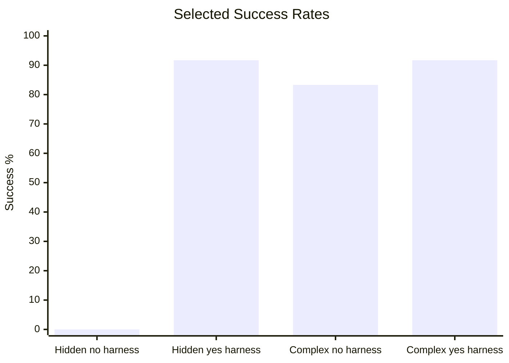

# Harness Agent Benchmark Runner

Benchmark evidence for measuring coding-agent performance on deterministic
repository tasks. This README is intentionally performance-focused; operational
usage details live in code, task specs, and benchmark reports.

## Latest Performance

The latest Flask harness-effect A/B run uses hidden-oracle tasks where the
prompt names a repository-specific API but does not restate the full response
contract. The deterministic oracle lives in this runner, outside the
agent-visible target clone. Codex was run with medium reasoning and priority
service tier:
`CODEX_EXEC_ARGS='-c model_reasoning_effort=medium -c service_tier=priority'`.

| Target | Harness | Agent | Runs | Strict scored successes | Strict success rate | Verification passed | Wrong-file edits | Forbidden-file edits | Timeouts |
| --- | --- | --- | ---: | ---: | ---: | ---: | ---: | ---: | ---: |
| `flask-no-harness` | No | Codex CLI | 12 | 0 | 0% | 0 | 11 | 0 | 3 |
| `flask-yes-harness` | Yes | Codex CLI | 12 | 11 | 91.7% | 11 | 0 | 0 | 0 |

Interpretation: when the exact scoring contract is hidden from the target
repository, the harnessed target improved hidden contract discovery and strict
boundary adherence. Verification success measures functional correctness;
wrong-file edits measure whether the agent kept changes inside the task
boundary. The bare target repeatedly guessed route names and response shapes,
while the harnessed target discovered the repository-local contracts from its
agent instructions and conventions.

Detailed report:
[`docs/benchmarks/2026-06-11-hidden-oracle-harness-effect-ab-3x.md`](docs/benchmarks/2026-06-11-hidden-oracle-harness-effect-ab-3x.md).

## What Yes-Harness Improved

The harnessed Flask target did not make the underlying app easier. It made the
repository's expectations easier for the agent to discover and follow.

| Dimension | `flask-no-harness` | `flask-yes-harness` | Observed effect |
| --- | --- | --- | --- |
| Strict scored success | 0/12 | 11/12 | Harnessed tasks completed the hidden contracts while staying inside strict scoring rules. |
| Verification passed | 0/12 | 11/12 | Functional correctness became the main separator once the oracle was hidden. |
| File boundaries | 11 task-boundary misses | 0 task-boundary misses | Harness guidance kept edits inside the task's expected paths. |
| Timeouts | 3 timeouts | 0 timeouts | Harness guidance reduced long-running failed exploration. |
| Contract discovery | Guessed routes and response shapes | Used documented conventions | Repository-local knowledge translated into concrete API behavior. |

The most important difference is not raw Flask coding ability. The hidden run
shows the harness is useful when success depends on repository-local knowledge:
route names, response shapes, thresholds, companion-document placement, and
allowed edit boundaries.

## Benchmark Evidence

| Scope | Agent | Mode | Runs | Strict scored successes | Strict success rate | Wrong-file edits | Forbidden-file edits | Timeouts |
| --- | --- | --- | ---: | ---: | ---: | ---: | ---: | ---: |
| `flask-yes-harness` hidden-oracle A/B | Codex CLI | Live adapter (3x) | 12 | 11 | 91.7% | 0 | 0 | 0 |
| `flask-no-harness` hidden-oracle A/B | Codex CLI | Live adapter (3x) | 12 | 0 | 0% | 11 | 0 | 3 |
| `flask-yes-harness` complex harness-effect A/B | Codex CLI | Live adapter (3x) | 12 | 11 | 91.7% | 0 | 0 | 1 |
| `flask-no-harness` complex harness-effect A/B | Codex CLI | Live adapter (3x) | 12 | 10 | 83.3% | 2 | 0 | 0 |
| `flask-yes-harness` harness-effect A/B | Codex CLI | Live adapter (3x) | 6 | 6 | 100% | 0 | 0 | 0 |
| `flask-no-harness` harness-effect A/B | Codex CLI | Live adapter (3x) | 6 | 4 | 66.7% | 1 | 0 | 1 |
| `flask-yes-harness` 4-task pilot | Codex CLI | Live adapter (1x) | 4 | 3 | 75% | 0 | 0 | 1 |
| `flask-no-harness` 4-task pilot | Codex CLI | Live adapter (1x) | 4 | 3 | 75% | 0 | 0 | 1 |
| `harness-starter-kit` 8-task dry run | Claude Code CLI | Live adapter (5x) | 40 | 37 | 92.5% | 0 | 0 | 0 |
| `harness-starter-kit` 8-task dry run | Codex CLI | Live adapter (5x) | 40 | 34 | 85% | 0 | 0 | 4 |
| `harness-starter-kit` 8-task dry run | Codex CLI | Live adapter (1x) | 8 | 8 | 100% | 0 | 0 | 0 |
| `harness-starter-kit` 8-task dry run | Claude Opus | Patch replay | 8 | 8 | 100% | 0 | 0 | 0 |

No-op validation runs are excluded from the performance table because they are
negative controls, not agent scores. They are documented in the detailed
benchmark reports.

## What The Metrics Mean

- `Strict scored success`: final scored success after agent exit, diff check,
  verification, and file-boundary checks.
- `Verification passed`: deterministic oracle success before file-boundary
  penalties.
- `Wrong-file edits`: changed files outside the task's expected file boundary.
  In the Flask hidden-oracle runs this primarily means root `README.md` edits
  outside `expected_files` (`app/**`, `tests/**`, and `docs/**`); it is not a
  functional failure by itself and not a general claim that README edits are
  bad. It is a strict boundary miss.
- `Forbidden-file edits`: changed files matching explicitly forbidden patterns.
- `Timeouts`: agent process failed to exit before the effective task timeout.

A passing test suite alone is not counted as full success when file boundaries
are violated.

## Current Findings

- Hidden-oracle Flask A/B is the strongest harness-positive evidence so far:
  `flask-yes-harness` reached 11/12 while `flask-no-harness` reached 0/12.
  Its wrong-file signal should be read as task-boundary adherence, especially
  around root `README.md` versus allowed companion docs under `docs/**`.
- The earlier complex run remains useful as a methodology lesson: when oracle
  code is visible in both target clones, a capable no-harness agent can recover
  much of the expected contract.
- The first plain Flask pilot was too easy to show harness lift: both bare and
  harnessed targets produced 4/4 verification passes and 3/4 scored successes.
- The larger `harness-starter-kit` repeated runs show strong boundary
  discipline across agents: 0 wrong-file edits and 0 forbidden-file edits in
  the current Codex and Claude Code 5x snapshots.
- Codex failures in repeated runs are mostly timeout or exact-oracle misses,
  not broad file-boundary failures.

## Detailed Reports

- [`docs/benchmarks/latest.md`](docs/benchmarks/latest.md)
- [`docs/benchmarks/2026-06-11-hidden-oracle-harness-effect-ab-3x.md`](docs/benchmarks/2026-06-11-hidden-oracle-harness-effect-ab-3x.md)
- [`docs/benchmarks/2026-06-11-complex-harness-effect-ab-3x.md`](docs/benchmarks/2026-06-11-complex-harness-effect-ab-3x.md)
- [`docs/benchmarks/2026-06-11-harness-effect-ab-3x.md`](docs/benchmarks/2026-06-11-harness-effect-ab-3x.md)
- [`docs/benchmarks/2026-06-11-flask-yes-harness-codex-pilot.md`](docs/benchmarks/2026-06-11-flask-yes-harness-codex-pilot.md)
- [`docs/benchmarks/2026-06-11-flask-no-harness-codex-pilot.md`](docs/benchmarks/2026-06-11-flask-no-harness-codex-pilot.md)
- [`docs/benchmarks/2026-06-11-codex-cli-5runs.md`](docs/benchmarks/2026-06-11-codex-cli-5runs.md)
- [`docs/benchmarks/2026-06-11-claude-code-5runs.md`](docs/benchmarks/2026-06-11-claude-code-5runs.md)
- [`docs/benchmarks/2026-06-11-benchmark-records-analysis.md`](docs/benchmarks/2026-06-11-benchmark-records-analysis.md)

Raw `runs/` and `results/` artifacts are intentionally not committed. Public
reports summarize reproducible, credential-safe fields from local records.
