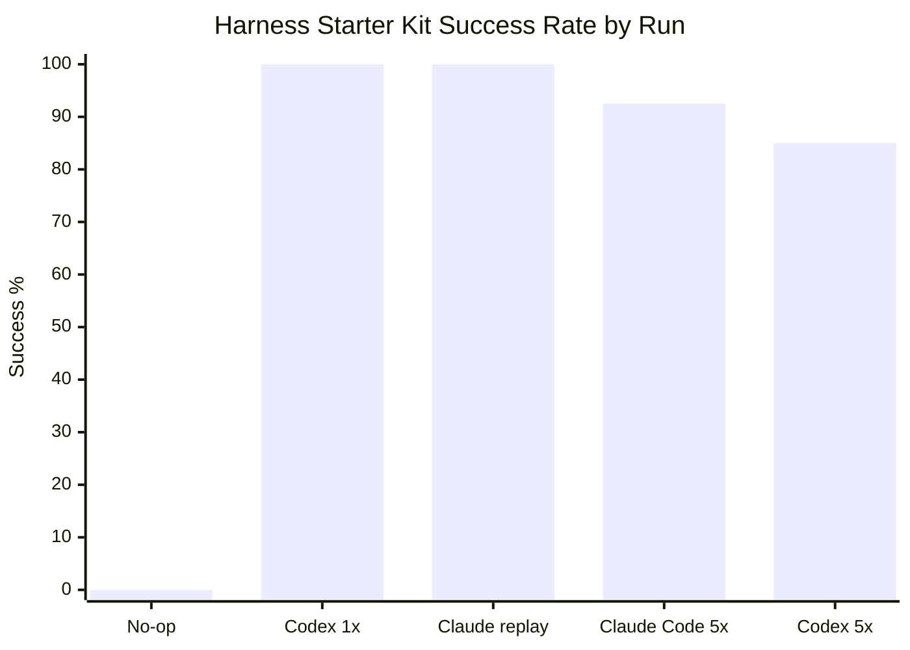

# Harness Agent Benchmark Runner

Continuous benchmark runner for measuring coding-agent performance against
repository-specific harness tasks.

This repository owns the runner infrastructure. The repositories being measured
own their task definitions, success oracles, and project-specific checks.

## Benchmark Status

Current infrastructure status:

- Runner: operational for isolated clone execution, deterministic verification,
  file-boundary scoring, and JSONL result collection.
- First target: `harnessworks/harness-starter-kit`.
- Latest comparable snapshot: 2026-06-11, same 8 deterministic tasks. Codex CLI
  live adapter was measured for 5 repetitions per task: 34/40 successes, 0
  wrong-file edits, 0 forbidden-file edits, and 4 timeouts.
- Current note: repeated live measurements now exist for Codex CLI and Claude
  Code CLI. Claude Opus patch replay remains a deterministic solution-quality
  check, not a live latency or cost measurement.
- New target: local `flask-no-harness` validates a plain Flask app without
  harness-specific files. No-op is 0/4 with clean boundaries; the first Codex
  live pilot is 3/4 with 4/4 verification passes and one timeout.

| Scope | Agent | Mode | Runs | Successes | Wrong-file edits | Forbidden-file edits | Timeouts |
| --- | --- | --- | ---: | ---: | ---: | ---: | ---: |
| `harness-starter-kit` 8-task dry run | Codex CLI | Live adapter (5×) | 40 | 34 | 0 | 0 | 4 |
| `harness-starter-kit` 8-task dry run | Claude Code CLI | Live adapter (5×) | 40 | 37 | 0 | 0 | 0 |
| `harness-starter-kit` 8-task dry run | Codex CLI | Live adapter (1×) | 8 | 8 | 0 | 0 | 0 |
| `harness-starter-kit` 8-task dry run | Claude Opus | Patch replay | 8 | 8 | 0 | 0 | 0 |
| `flask-no-harness` 4-task baseline | No-op | Target validation | 4 | 0 | 0 | 0 | 0 |
| `flask-no-harness` 4-task pilot | Codex CLI | Live adapter (1×) | 4 | 3 | 0 | 0 | 1 |



The no-op baseline is a harness validation run, not an agent score.

Latest summary: [`docs/benchmarks/latest.md`](docs/benchmarks/latest.md).
Full records analysis:
[`docs/benchmarks/2026-06-11-benchmark-records-analysis.md`](docs/benchmarks/2026-06-11-benchmark-records-analysis.md).

## Goal

Run agent tasks repeatedly in isolated clones, collect deterministic evidence,
and produce comparable metrics:

- task success rate
- first-pass verification rate
- wrong-file edit rate
- forbidden-file edit rate
- verification failure rate
- runtime per task
- changed-file boundary violations

The runner should not decide product quality by itself. It records deterministic
signals first, then leaves judgment-heavy fields to a reviewer or a separate
read-only evaluation agent.

## Repository Layout

```text
benchmarks/tasks/      Example task specs.
docs/benchmarks/       Public benchmark summaries and methodology notes.
examples/agents/       Tiny local agent adapters for smoke tests.
src/                   Runner package.
tests/                 Unit tests for task loading, scoring, and summaries.
results/               Local JSONL result output, ignored by git.
runs/                  Per-run cloned workspaces and logs, ignored by git.
```

## Quick Start

Run the local test suite:

```bash
python3 -m unittest discover -s tests
```

Run one benchmark task against a sibling `harness-starter-kit` checkout:

```bash
python3 -m harness_agent_benchmark_runner run \
  --task benchmarks/tasks/harness-starter-kit-smoke.json \
  --agent-command "python3 $PWD/examples/agents/noop_agent.py"
```

Summarize local results:

```bash
python3 -m harness_agent_benchmark_runner summarize --results results
```

## Task Spec

Task specs are JSON in the initial version so the runner works with the Python
standard library only.

```json
{
  "schema_version": 1,
  "id": "example-task",
  "description": "Short human-readable scenario.",
  "repo": {
    "source": "../target-repo",
    "ref": "main"
  },
  "prompt": "Do the task the agent should attempt.",
  "timeout_seconds": 900,
  "max_attempts": 1,
  "max_cost_usd": 2.5,
  "expected_files": ["docs/**", "scripts/**"],
  "forbidden_files": [".env", "**/.env", "node_modules/**"],
  "verification": {
    "commands": [
      {
        "name": "unit tests",
        "command": ["python3", "-m", "unittest", "discover", "-s", "tests"],
        "timeout_seconds": 300
      }
    ]
  }
}
```

`repo.source` can be a local path or a Git URL. Relative local paths are resolved
from the current working directory first, then from the task file directory.

`timeout_seconds` limits the agent command. `max_attempts` controls how many
fresh isolated attempts the CLI may run before returning failure. Keep
`max_attempts` at `1` when measuring strict first-pass performance.

`max_cost_usd` is recorded and passed to agent adapters as a budget hint. The
runner cannot enforce provider spend directly; adapters and provider-side
budget controls must honor it.

## Agent Adapter Contract

The runner executes `--agent-command` inside the isolated clone. It sets these
environment variables:

- `BENCHMARK_REPO`: absolute path to the isolated repository clone
- `BENCHMARK_PROMPT_FILE`: path to the task prompt text file
- `BENCHMARK_PROMPT`: prompt text
- `BENCHMARK_TASK_ID`: task id
- `BENCHMARK_RUN_ID`: unique run id
- `BENCHMARK_ATTEMPT_NUMBER`: 1-based attempt number
- `BENCHMARK_ATTEMPT_LIMIT`: configured attempt limit
- `BENCHMARK_TIMEOUT_SECONDS`: effective agent timeout for this attempt
- `BENCHMARK_MAX_COST_USD`: optional budget hint, when configured

Any agent command that can read those values and edit the isolated clone can be
used. For example, a wrapper script can call Codex CLI, Claude Code, Aider, or a
custom OpenAI API agent.

Because the command runs from the isolated target repository clone, reference
local adapter scripts with an absolute path such as
`python3 $PWD/examples/agents/noop_agent.py` when invoking the runner from this
repository root.

The Codex CLI example adapter is:

```bash
python3 -m harness_agent_benchmark_runner run \
  --task benchmarks/tasks/harness-starter-kit-smoke.json \
  --agent-command "python3 $PWD/examples/agents/codex_exec_agent.py" \
  --max-agent-timeout 900 \
  --max-cost-usd 2.5
```

The adapter reads these optional environment variables:

- `CODEX_BIN`: Codex binary, default `codex`
- `CODEX_MODEL`: model argument passed as `--model`
- `CODEX_PROFILE`: Codex profile passed as `--profile`
- `CODEX_APPROVAL_POLICY`: default `never`
- `CODEX_SANDBOX`: default `workspace-write`
- `CODEX_EXEC_ARGS`: extra shell-parsed arguments appended to `codex exec`

The Claude Code example adapter is:

```bash
python3 -m harness_agent_benchmark_runner run \
  --task benchmarks/tasks/harness-starter-kit-smoke.json \
  --agent-command "python3 $PWD/examples/agents/claude_code_agent.py" \
  --max-agent-timeout 900 \
  --max-cost-usd 2.5
```

It requires an authenticated Claude Code CLI on the host. The adapter uses
Claude Code print mode and passes the benchmark prompt on stdin with a short
query argument. Its default permission mode is `bypassPermissions`, so run it
only through the runner's isolated clone/workspace path.

The adapter reads these optional environment variables:

- `CLAUDE_BIN`: Claude Code binary, default `claude`
- `CLAUDE_MODEL`: model argument passed as `--model`
- `CLAUDE_PERMISSION_MODE`: default `bypassPermissions`
- `CLAUDE_MAX_TURNS`: optional `--max-turns` value
- `CLAUDE_NO_SESSION_PERSISTENCE`: default `1`
- `CLAUDE_PROMPT_ARG`: short print-mode query used with the stdin prompt
- `CLAUDE_EXTRA_ARGS`: extra shell-parsed arguments appended to `claude -p`

When `BENCHMARK_MAX_COST_USD` is set, the adapter forwards it to Claude Code as
`--max-budget-usd`.

## Scoring

A run is marked successful only when:

- the agent command exits with code `0`
- `git diff --check` exits with code `0`
- all verification commands exit with code `0`
- no changed file falls outside `expected_files`, when expected files are set
- no changed file matches `forbidden_files`

The raw result is always preserved under `runs/<run-id>/result.json` and appended
to `results/YYYY-MM-DD.jsonl`.

When retries are enabled, each attempt gets a fresh isolated clone and writes its
own result record. The CLI exits successfully if any configured attempt succeeds.

## 24-Hour Operation

The intended production setup is a self-hosted runner, launchd job, systemd
timer, or small scheduler that repeatedly calls:

```bash
python3 -m harness_agent_benchmark_runner run \
  --task <task-spec> \
  --agent-command <agent-wrapper> \
  --max-agent-timeout <seconds> \
  --max-cost-usd <budget>
```

Use an external scheduler for now. Keeping scheduling outside the runner makes
timeouts, API keys, cost limits, and machine isolation easier to audit.
