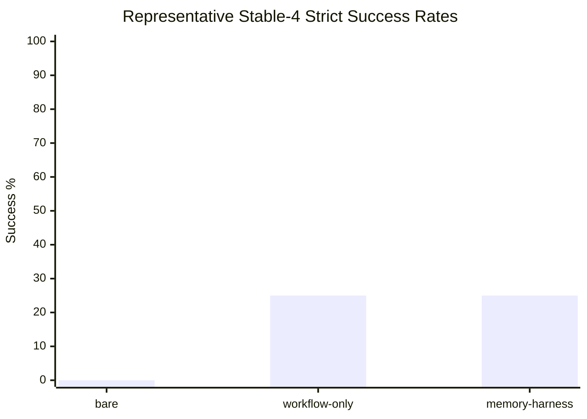

# Harness Agent Benchmark Runner

Benchmark infrastructure for running coding agents safely and measuring why
they succeed or fail.

## At A Glance

- Product claim: the kit is strong at making agent work isolated, auditable,
  and measurable.
- Representative result: a clean 96-record three-arm Flask promotion with
  0 stalls, 0 timeouts, 0 hidden-access findings, and 0 file-boundary issues.
- Observed lift: harness arms recovered schema-contract behavior in 24/32
  records; `bare` recovered 0/32.
- Current limit: `memory-harness` did not beat `workflow-only` on correctness,
  and `cart-validation` failed across all arms.
- Next step: do not run another blind 96/100-record H1 promotion until the
  repeated no-edit watchdog path is mitigated or explicitly studied.

Safe claims:

- The runner separates functional, schema, workflow, boundary, timeout, and
  hidden-access failures.
- The harness helps agents preserve repo-local API/documentation conventions in
  this suite.
- The latest representative run was operationally clean enough to publish.

Claims not supported yet:

- The harness generally improves raw coding ability across arbitrary tasks.
- Memory guidance is more accurate than workflow-only guidance.
- Parallel `jobs=2` timeout stability is solved.

The runner executes every attempt in an isolated clone or worktree under
`runs/`, writes append-only local records under `results/`, and publishes only
credential-safe summaries under `docs/benchmarks/`.

## Benchmark Status

Representative result:
[`docs/benchmarks/2026-06-13-hidden-flask-three-arm-stable4-allslim-promotion96.md`](docs/benchmarks/2026-06-13-hidden-flask-three-arm-stable4-allslim-promotion96.md).

Supported kit-effect claim:

> In answer-free held-out Flask tasks, the kit made agent work safer and more
> measurable, and the harnessed repos preserved project API/schema conventions
> that the bare repo missed. The representative run completed 96/96 records
> with no operational abnormal events, and schema-contract success improved
> from 0/32 in `bare` to 24/32 in both harness arms.

This 96-record sequential three-arm promotion is the current representative
evidence because it used answer-free partial-realistic prompts, compared
`bare`, `workflow-only`, and `memory-harness` targets, kept task-specific
answers out of target repositories, and scored results with a hidden oracle
from this runner repository.

Headline: all 96 planned records completed with 0 stalls, 0 timeouts,
0 hidden-access findings, 0 wrong-file edits, and 0 forbidden-file edits.
There were 80 expected benchmark failures, but no operational abnormal events.

| Arm | Runs | Strict successes | Functional successes | Schema successes | Workflow successes | Boundary clean | p95 duration | Max duration |
| --- | ---: | ---: | ---: | ---: | ---: | ---: | ---: | ---: |
| `bare` | 32 | 0 | 0 | 0 | 32 | 32 | 134.6s | 639.3s |
| `workflow-only` | 32 | 8 | 8 | 24 | 32 | 32 | 124.1s | 544.7s |
| `memory-harness` | 32 | 8 | 8 | 24 | 32 | 32 | 86.2s | 87.6s |

The product reading is narrow and useful:

- The kit is strong at making agent work measurable: strict, functional,
  schema, workflow, boundary, timeout, and duration-tail signals are reported
  separately.
- The harness arms recovered schema-contract behavior in 24/32 records, while
  `bare` recovered 0/32.
- The only strict correctness lift was `catalog-segments`, where both harness
  arms passed 8/8 and `bare` passed 0/8.
- `cart-validation` stayed 0/8 strict across all arms, which is useful failure
  evidence rather than a runner failure.
- `memory-harness` did not beat `workflow-only` on correctness. Its current
  signal is operational repeatability: max duration was 87.6s versus 544.7s
  for `workflow-only` and 639.3s for `bare`.

Latest execution:
[`docs/benchmarks/2026-06-14-flask-h1-strengthened-prompt-guard-decision-gate16.md`](docs/benchmarks/2026-06-14-flask-h1-strengthened-prompt-guard-decision-gate16.md).
After strengthening the answer-free Codex prompt guard, a bounded
decision-bearing H1 gate completed 16/16 strict with 0 no-edit watchdogs.
This makes a scoped guarded H1 promotion attempt defensible again, but it is
not itself a 96/100-run result.

The older balanced 100-run `jobs=2` report remains a full-contract control, not
the main product claim. Its timeout stability remains unresolved because the
parallel run produced timeout noise.

## Product Effects Shown By The Benchmark

The representative run supports four product effects:

- Agent failures become controlled failures instead of dirty repository states.
- Hidden-oracle feedback turns vague misses into specific contract, schema, and
  edge-case findings.
- Repo-local workflow and domain guidance can steer agents into a successful
  implementation pattern on tasks that depend on conventions.
- Repeated runs become comparable because execution, workflow, boundary, and
  verification signals are recorded separately.

## Why This Kit Matters

The kit is valuable when an agent result must be safe enough to inspect and
precise enough to learn from.

| Need | What the kit provides | Evidence in representative run |
| --- | --- | --- |
| Isolate work | Each attempt runs in a fresh clone/worktree under `runs/`. | 96/96 records completed without dirty-source or runner abnormal findings. |
| Prevent answer leakage | Task specs and hidden oracles stay in the runner, not the target repo. | 0 hidden-access findings under `CODEX_PROMPT_GUARD=1`. |
| Enforce boundaries | Expected and forbidden paths are checked after the agent exits. | 0 wrong-file edits and 0 forbidden-file edits across all arms. |
| Separate failure modes | Functional, schema, workflow, boundary, strict, timeout, and duration metrics are distinct. | 80 non-strict records were classified as expected benchmark failures, not runner failures. |
| Make failures actionable | Reports preserve per-task clusters instead of hiding them in one score. | `cart-validation` is now clearly a hard semantic/API-design task, not a harness-memory discriminator. |
| Keep prompts realistic | Stable conventions can live in repo guidance while task-specific answers stay out. | Harness arms recovered schema conventions without exposing exact hidden oracle payloads. |

This framing is important. A passing test suite alone is not enough when an
agent edits the wrong file, touches a forbidden path, leaks hidden answers, or
times out after producing a plausible diff. The runner measures those cases
explicitly.

## Benchmark Model

Current harness-effect experiments use three arms:

| Arm | Target meaning |
| --- | --- |
| `bare` | Plain target repository with no harness guidance. |
| `workflow-only` | Repository has AGENTS guidance, local gate, docs placement rules, and boundary conventions. |
| `memory-harness` | Repository has workflow guidance plus generalized project conventions and failure memory. |

Prompt levels are intentionally separated:

| Prompt level | Use |
| --- | --- |
| `partial-realistic` | Main product experiment. The prompt omits task-specific answer strings and asks whether repo conventions transfer. |
| `full-contract` | Control experiment. The prompt discloses the exact contract, so a small harness gap is expected. |

Task-specific answer strings do not belong in target docs or memory. Examples
to avoid include exact response keys, hidden oracle payloads, and route-specific
answer catalogs for the task being scored.

## Metric Definitions

- `Strict successes`: final scored successes after preflight, agent exit, diff
  checks, verification, and file-boundary checks.
- `Functional success`: hidden-oracle behavior for endpoint semantics, status
  codes, calculations, mutations, and edge cases.
- `Schema contract success`: response envelope, key naming, metadata, and
  API-style checks.
- `Workflow success`: agent exit, diff check, local workflow/gate commands, and
  file-boundary checks.
- `Verification passed`: deterministic pytest plus hidden-oracle success before
  any file-boundary penalty.
- `Boundary issues`: wrong-file edits plus forbidden-file edits.
- `Wrong-file edits`: changes outside the task's expected file boundary. In
  these Flask runs, root `README.md` is outside the allowed companion-docs path
  (`docs/**`) unless the task explicitly asks for README changes. A README edit
  here is not a functional failure by itself; it is a strict boundary miss.
- `Forbidden-file edits`: changes matching explicitly forbidden patterns.
- `Timeouts`: agent process failed to exit before the effective task timeout.
- `Stalls`: agent process was stopped by the pilot stall watchdog, idle-output
  watchdog, or no-edit watchdog. Count this separately from product-quality
  oracle failures.
- `Preflight failures`: leakage or readiness failures before agent execution.
  These should fail the run without spending model budget.

## Current Evidence

| Scope | Mode | Runs | Strict successes | Verification passed | Timeouts | Boundary issues | Reading |
| --- | --- | ---: | ---: | ---: | ---: | ---: | --- |
| Three-arm stable-4 | `bare` promotion96 | 32 | 0 | 0 | 0 | 0 | Strong negative baseline under answer-free prompts. |
| Three-arm stable-4 | `workflow-only` promotion96 | 32 | 8 | 8 | 0 | 0 | Repo workflow and conventions recover schema behavior. |
| Three-arm stable-4 | `memory-harness` promotion96 | 32 | 8 | 8 | 0 | 0 | Same correctness as workflow-only, lower duration tail. |
| Three-arm v2 | replenishment smoke | 3 | 2 | 2 | 0 | 0 | Scaffold check; not yet representative. |
| Balanced Flask A/B | 100-run `jobs=2` full-contract control | 100 | 94 | 95 | 3 | 0 | Useful control, but parallel timeout stability remains unresolved. |

Older `harness-starter-kit` runs remain useful agent-adapter evidence. The
Flask hidden-oracle rows are the relevant harness-effect evidence.



## Operating Guidance

Before a real pilot or promotion:

- Keep the source repository clean unless the task explicitly documents why a
  dirty source is required.
- Run each attempt in an isolated clone or worktree under `runs/`.
- Run leakage audits before execution; a hidden-answer hit should stop the run.
- Keep deterministic scoring in the runner or target oracle, not in LLM-only
  review.
- Report functional, schema, workflow, boundary, strict, timeout, and duration
  metrics separately.
- Publish public-safe summaries in `docs/benchmarks/`; do not commit raw
  `runs/`, `results/`, local logs, cloned repositories, credentials, or keys.

Validation for this repository:

```bash
python3 -m unittest discover -s tests
```

Smoke run against a sibling `harness-starter-kit` checkout:

```bash
python3 -m harness_agent_benchmark_runner run \
  --task benchmarks/tasks/harness-starter-kit-smoke.json \
  --agent-command "python3 $PWD/examples/agents/noop_agent.py"
```

## What Comes Next

Do not spend the next run on another identical stable-4 promotion. The
representative 96-record result is clean enough for its current scope.

The next product path is the v2 held-out suite at
`benchmarks/suites/flask-hidden-three-arm-v2.json`, currently covering
`hidden-effect-replenishment-signals`, `hidden-effect-catalog-price-ladder`,
and `hidden-effect-catalog-value-snapshot`. Run a fresh 9-record v2 pilot
before any larger promotion.

Keep these rules for v2:

- Preserve the same three arms: `bare`, `workflow-only`, and `memory-harness`.
- Use `partial-realistic` prompts as the main product experiment.
- Use `full-contract` prompts only as controls.
- Keep task-specific answers out of target docs and failure memory.
- Include functional and schema oracle dimensions for each task.
- Keep route leakage audits and public-safe reporting mandatory.

`cart-validation` should be split or redesigned before using it as a memory
discriminator. In the representative run it behaved as a hard semantic/API
design task: all arms scored 0/8 strict and 0/8 schema.

## Reports

- [`docs/benchmarks/latest.md`](docs/benchmarks/latest.md)
- [`docs/benchmarks/2026-06-13-hidden-flask-three-arm-stable4-allslim-promotion96.md`](docs/benchmarks/2026-06-13-hidden-flask-three-arm-stable4-allslim-promotion96.md)
- [`docs/benchmarks/2026-06-13-hidden-flask-three-arm-v2-smoke.md`](docs/benchmarks/2026-06-13-hidden-flask-three-arm-v2-smoke.md)
- [`docs/benchmarks/2026-06-13-hidden-flask-workflow-smoke-stable4-fullcontract-control.md`](docs/benchmarks/2026-06-13-hidden-flask-workflow-smoke-stable4-fullcontract-control.md)
- [`docs/benchmarks/2026-06-12-hidden-flask-balanced-ab-100-jobs2.md`](docs/benchmarks/2026-06-12-hidden-flask-balanced-ab-100-jobs2.md)
- [`docs/benchmarks/2026-06-11-hidden-oracle-harness-effect-ab-3x.md`](docs/benchmarks/2026-06-11-hidden-oracle-harness-effect-ab-3x.md)

Raw `runs/`, `results/`, local logs, cloned repositories, and credentials are
intentionally not committed. Public reports summarize reproducible,
credential-safe fields from local records.
